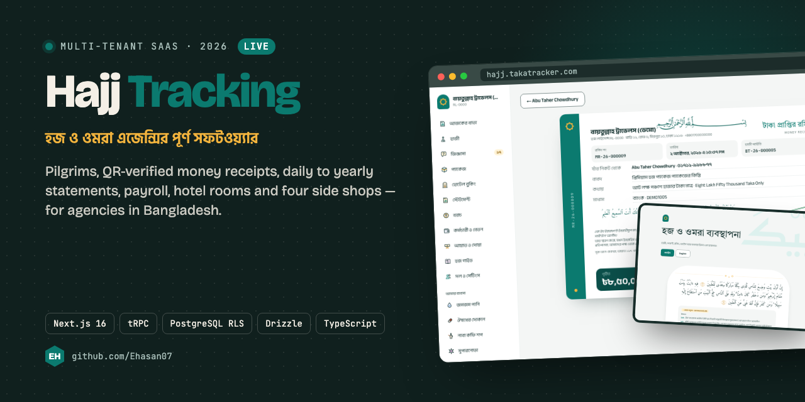
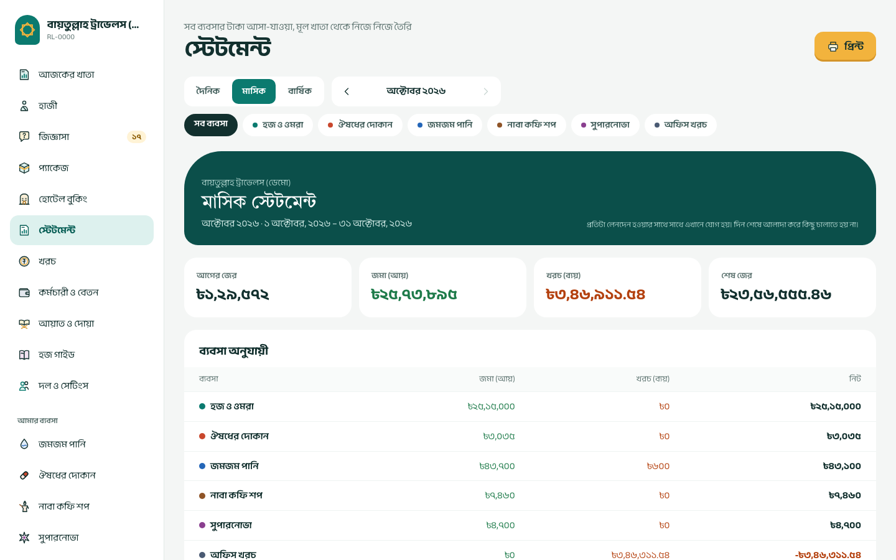
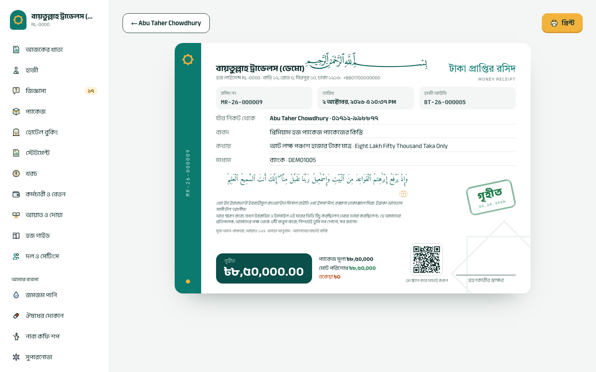
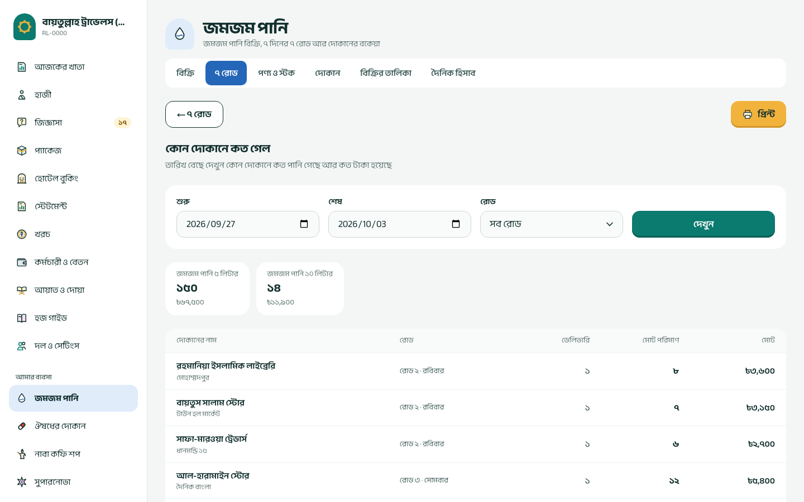
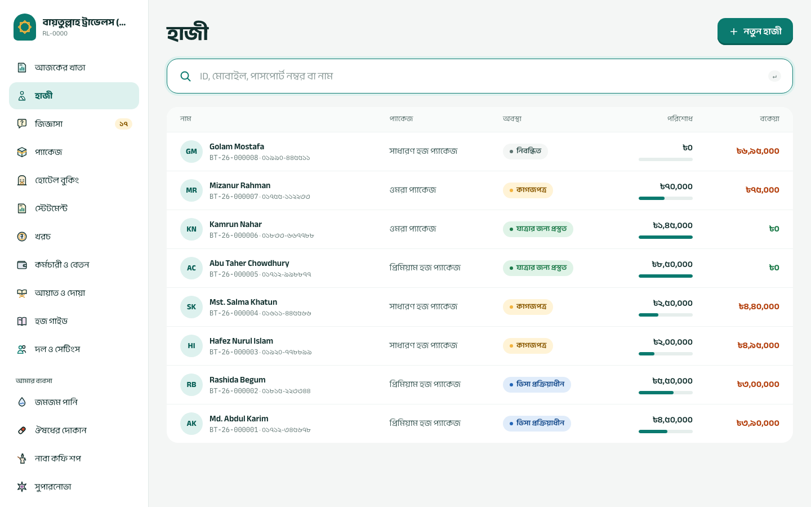
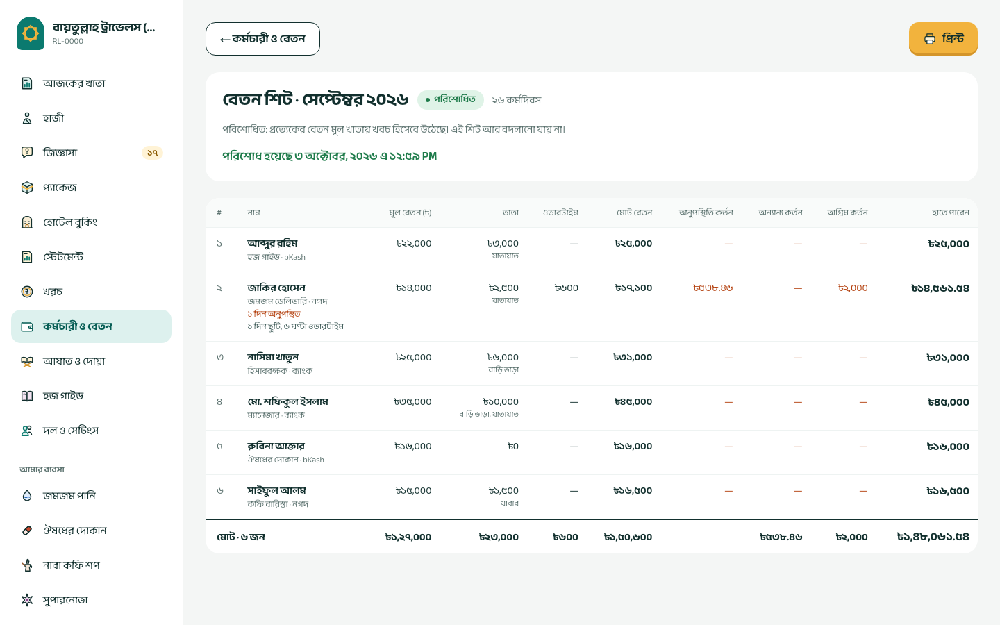
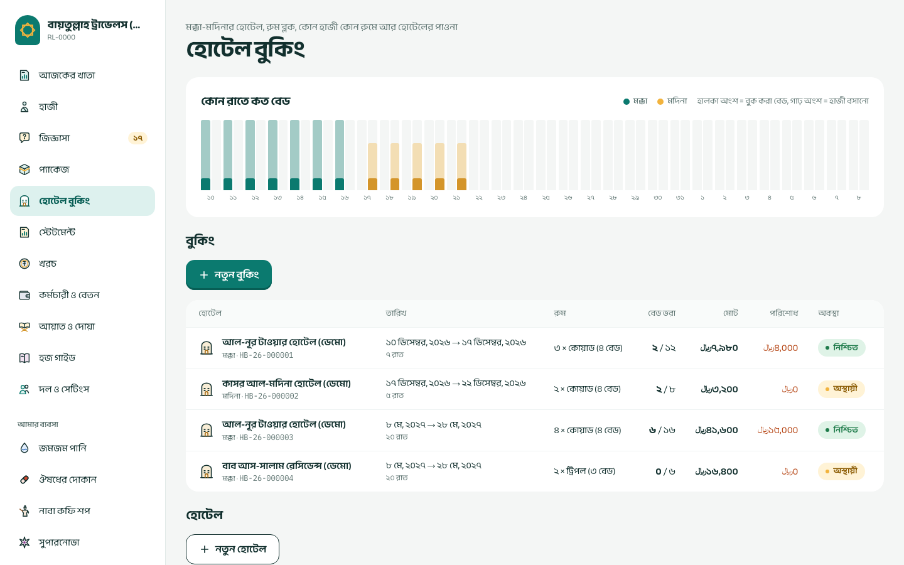
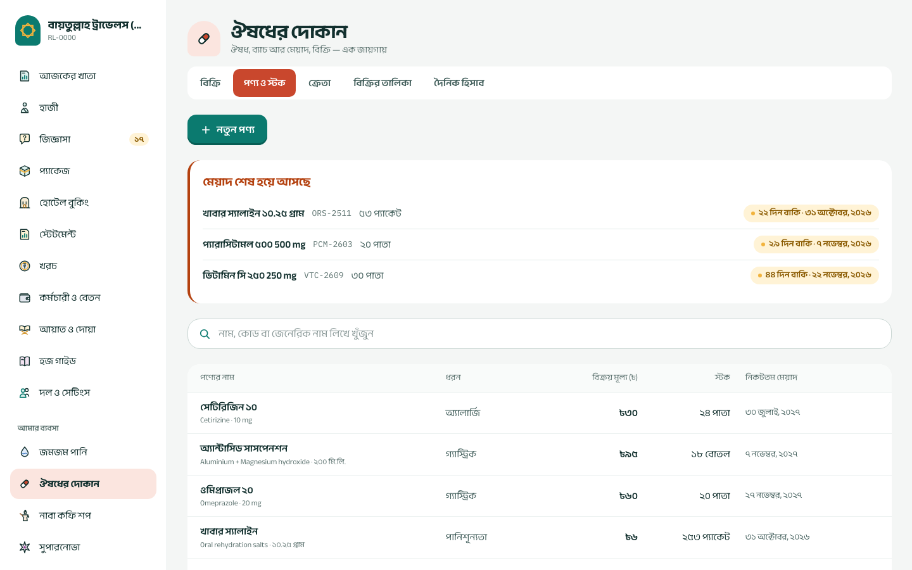
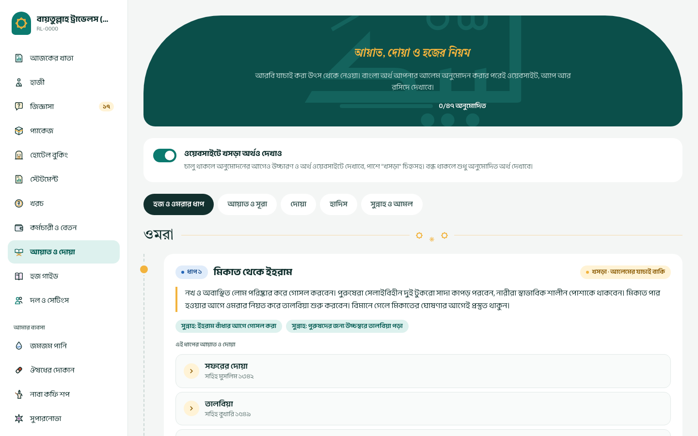

<!-- banner -->
<p align="center"></p>

<p align="center"><a href="https://hajj.takatracker.com"><b>Live: hajj.takatracker.com</b></a> · <a href="#a-look-inside">A look inside</a> · <a href="#features-so-far">Features</a> · <a href="#local-setup">Run it</a></p>


<p align="center">
    
</p>

## A look inside

| | |
|---|---|
|  <br><sub>Monthly statement across every business, straight from the ledger</sub> |  <br><sub>A5 money receipt in Bangla and English, with a QR code anyone can verify</sub> |
|  <br><sub>Zamzam water: seven weekday routes and which shop got how much</sub> |  <br><sub>Pilgrim register with paid and due at a glance</sub> |
|  <br><sub>Monthly salary sheet: draft, lock, pay into the ledger</sub> |  <br><sub>Makkah and Madinah hotel blocks, rooms filled night by night</sub> |
|  <br><sub>Medicine shop: batches, expiry warnings, earliest expiry sold first</sub> |  <br><sub>Verses and duas with Bangla pronunciation and meaning, reviewed by a scholar</sub> |
<!-- /banner -->

# Hajj Tracking Software

Hajj and Umrah agency management, built as a multi-tenant SaaS. Bangla and English, BDT and SAR.

## What's inside

| Path | Purpose |
|---|---|
| `apps/web` | Next.js app: public website, admin dashboard, auth and API routes |
| `packages/core` | Pure calculation logic: money, amount in words, references, salary, statements |
| `packages/db` | PostgreSQL schema (Drizzle), migrations, row level security, tenant helper |
| `packages/api` | tRPC routers shared by the web app and the mobile apps |
| `packages/i18n` | Bangla and English messages |

## Features so far

- Agencies sign up, choose an ID prefix and the businesses they run
- Inquiry log for people who visit or call, with follow-ups and one-click registration
- Pilgrim register with auto IDs (`AM-26-000001`), search by ID, mobile, passport or name
- Passport details read from the MRZ lines; numbers encrypted, scans stored encrypted
- Payments with gap-free receipt numbers, due tracking and overpayment guard
- Printable A5 money receipt in Bangla and English with a QR code anyone can verify
- Receipt voiding with a reason and a reversing ledger entry
- Packages and a bilingual Hajj & Umrah guide
- Daily, monthly and yearly statements per business, straight from the ledger, printable on A4
- Office expenses in BDT or SAR, cancellable with a reversing entry
- Staff, advances and monthly salary sheets: draft, lock, pay (one ledger entry per person)
- Hotel bookings in Makkah and Madinah: room blocks priced per room per night, pilgrims placed in rooms, no double booking, payments to the hotel, nightly occupancy
- One shop engine for the side businesses, each with its own sale numbers:
  - Medicine shop: batches with expiry dates, earliest expiry sold first, expiry warnings
  - Zamzam water: seven routes for the seven days, shops on each route, a route-day sheet for deliveries and dues, and a report of which shop got how much
  - Naba Coffee and Supernova: menu or product list, quick sales, daily statement
- Separate logins per colleague; a shop login sees only the shops it is given

## Ground rules

- Money is stored as integers in minor units (paisa / halala). No floats anywhere near a balance.
- Every tenant table is protected by row level security. The app connects as `hajj_app`, which never owns tables.
- The ledger is append-only. Mistakes are corrected with reversing entries.
- Every change to protected tables is written to `audit_log` by a database trigger.

## Local setup

Requirements: Node 22, Docker, Corepack.

```bash
corepack enable
cp .env.example .env          # then fill the secrets (openssl rand -base64 32)
pnpm install
pnpm db:up                    # postgres :5440, redis :6390, storage :9020
pnpm db:migrate
pnpm db:seed                  # demo agency for the public website
pnpm dev                      # http://localhost:3100
pnpm --filter @hajj/db seed:demo   # demo login with pilgrims, shops, salaries and hotels (app must be running)
```

## Checks

```bash
pnpm typecheck
pnpm test                     # core, i18n, database (RLS) and API flow tests
pnpm --filter @hajj/web build
npx playwright test           # browser tests: an office day, the public site, the side businesses
```

## Deploy

`Dockerfile` builds two targets: `web` (the Next.js standalone server) and `migrate` (runs database migrations).

On a server with Docker, from a clone of this repository:

```bash
sh deploy/deploy.sh hajj.example.com   # first run: writes deploy/.env with fresh secrets, builds, migrates, starts
sh deploy/deploy.sh                    # updates: pull, rebuild, migrate, restart
```

`deploy/docker-compose.prod.yml` runs Postgres, Redis, object storage, the app, a nightly database dump to `deploy/backups/` (14 days kept) and Caddy for HTTPS. Only Caddy is open to the internet. On a server that already has nginx or Caddy on ports 80/443, run with `PROXY=host` and forward the domain to `127.0.0.1:3100`.

Keep a copy of `deploy/.env` somewhere safe: the encryption keys in it are needed to read stored passport numbers.

### hajj.takatracker.com

That server already runs other sites, a VPN and its own PostgreSQL, so the app runs natively beside them instead of in Docker: user `hajj`, files in `/opt/hajj`, its own `hajj` database, systemd services `hajj` (app, memory-capped) and `hajj-storage` (local S3 store), nginx site `hajj.takatracker.com` with a Let's Encrypt certificate, and a nightly backup at 03:00 Dhaka to `/opt/hajj/backups`. To ship new code from a developer machine:

```bash
sh deploy/update-server.sh root@46.225.148.245   # build, back up, migrate, switch, check
```
